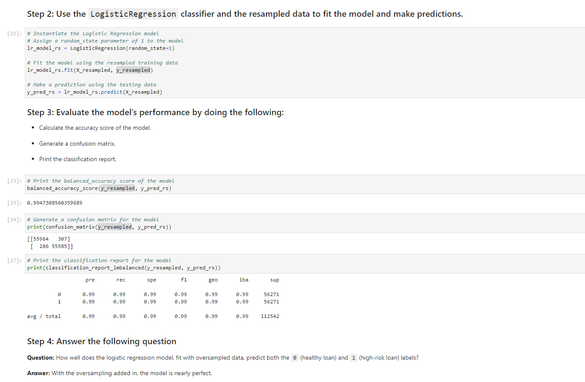

# module_12_challenge

The module 12 challenge for fintech course

The Jupyter Lab file follows along as an exercise to practice supervised learning using sklearn and other pandas libraries.

---

## Technologies

The sheet requires Pandas for analyzing data frames in jupyter labs.
It requires Jupyter Labs for a user interface.
It requires Path from pathlib to help read .csv files.
Requires sklearn and imbalanced-learn.

---

## Installation Guide

Other than Python 3.7, the sklearn packages are required, Jupyter Labs runs in a browser, including Chrome.  Launch the file by navigating to the directory of the file through a CLI and then running Jupyter labs, with "jupyter lab".

sklearn and imbalanced-learn can be installed form the CLI with the following:

conda list scikit-learn

conda install -c conda-forge imbalanced-learn

---

## Usage

The worksheet runs through a scenario and teaches the user to use supervised machine learning techniques.

---

## Contributors

Michael Canavan

---

## License

The content of the course is owned and managed by UC Berkeley Fintech Bootcamp.